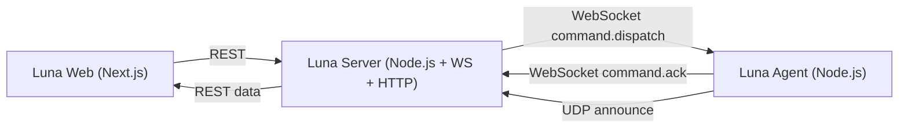

# Luna

Luna is a self-hosted virtual assistant for homelabs. It routes natural-language commands to registered devices (agents), executes local actions, and returns structured success/failure feedback to the web UI.

Current status: MVP through **Slice 49** (agent npm CLI package) is complete as of **April 3, 2026**.

## Table of Contents

- [Overview](#overview)
- [Architecture](#architecture)
- [Monorepo Structure](#monorepo-structure)
- [Supported Commands](#supported-commands)
- [Requirements](#requirements)
- [Environment Variables](#environment-variables)
- [Quick Start (Local Development)](#quick-start-local-development)
- [Run Embedded Server with Docker](#run-embedded-server-with-docker)
- [Build Artifacts](#build-artifacts)
- [HTTP API](#http-api)
- [Testing and Quality](#testing-and-quality)
- [Roadmap](#roadmap)
- [Contributing](#contributing)

## Overview

Luna's MVP flow:

1. Receive a command from the web chat.
2. Parse the command intent and target device.
3. Dispatch the command to the target agent over WebSocket.
4. Execute locally on the device.
5. Return `success` or `failed` with canonical failure reasons.
6. Persist command history in memory and expose it via REST.

## Architecture



Key behavior already implemented:

- Device presence (`online`/`offline`) with heartbeat timeout.
- Safe reconnect handling for the same device id.
- Discovery + approval flow for agents via UDP and REST.
- Capability-based dispatch validation before sending commands.
- Canonical failure reasons:
  - `invalid_params`
  - `unsupported_intent`
  - `execution_error`

## Monorepo Structure

```text
luna/
  apps/
    server/          # REST + WebSocket + discovery runtime
    web/             # Next.js chat/dashboard UI
    agent/           # Device runtime and local command executors
  packages/
    shared-types/    # Cross-app domain types
    protocol/        # WebSocket and UDP message contracts
    command-parser/  # Rule-based natural-language parser
```

## Supported Commands

The parser currently targets Portuguese command patterns.

- `open_app`
  - Example: `Abrir Spotify no Notebook 2`
  - Supported app aliases include: `spotify`, `chrome`, `vscode`
- `notify`
  - Example: `Notificar "Build finished" no Notebook 2`
- `set_volume`
  - Example: `Definir volume para 35% no Notebook 2`
- `play_media`
  - Example: `Tocar "lofi hip hop" no Notebook 2`

Notes:

- `notify` and `play_media` accept quoted and unquoted text.
- Device resolution supports both custom alias (`name`) and hostname fallback.

## Requirements

- Node.js 20+
- npm
- Windows target device for real launchers (`open_app`, `notify`, `set_volume`, `play_media`)

## Environment Variables

Copy `.env.example` to `.env` and adjust values as needed.

| Variable                      | Required | Default                  | Description                                    |
| ----------------------------- | -------- | ------------------------ | ---------------------------------------------- |
| `LUNA_SERVER_HOST`            | No       | `127.0.0.1`              | Server bind host                               |
| `LUNA_SERVER_PORT`            | No       | `4000`                   | Server port                                    |
| `LUNA_SERVER_STATIC_DIR`      | No       | empty                    | Directory to serve static web assets from      |
| `LUNA_AGENT_SERVER_URL`       | No       | `ws://127.0.0.1:4000`    | WebSocket server URL for agent                 |
| `LUNA_AGENT_DEVICE_ID`        | No       | OS hostname              | Stable device id                               |
| `LUNA_AGENT_DEVICE_NAME`      | No       | device hostname          | Display name/alias fallback                    |
| `LUNA_AGENT_DEVICE_HOSTNAME`  | No       | OS hostname              | Device hostname metadata                       |
| `NEXT_PUBLIC_LUNA_SERVER_URL` | No       | empty in embedded builds | Base URL used by web app (empty = same-origin) |

### Agent CLI Overrides

When running the agent, CLI flags override `.env` values:

- `--server-url`
- `--server-host`
- `--server-port`
- `--device-id`
- `--device-name`
- `--device-hostname`

Examples:

- `npm run start:agent -- --server-host 192.168.0.10 --server-port 4000`
- `dist-artifacts/agent/run-agent.cmd --server-host 192.168.0.10 --server-port 4000`

## Quick Start (Local Development)

1. Install dependencies:

```bash
npm install
```

2. Prepare environment:

```bash
cp .env.example .env
```

3. Start services in separate terminals:

```bash
# Terminal 1
npm run start:server

# Terminal 2
npm run start:agent

# Terminal 3
npm run start:web
```

4. Open the web UI (usually `http://127.0.0.1:3000`).

## Run Embedded Server with Docker

This image bundles server + exported web and serves both from port `4000`.

```bash
npm run docker:build:server
npm run docker:run:server
```

Then open:

- `http://127.0.0.1:4000/` (web)
- `http://127.0.0.1:4000/devices` (API check)

## Build Artifacts

Build TypeScript output:

```bash
npm run build
```

Build server artifact (includes embedded web):

```bash
npm run build:artifact:server
```

Build agent artifact:

```bash
npm run build:artifact:agent
```

Build both:

```bash
npm run build:artifacts
```

Generated artifact roots:

- `dist-artifacts/server`
- `dist-artifacts/agent`

For end users running Luna Agent on a device, use the published package (no local build required):

```bash
npm exec --yes --package @vitorqf/luna-agent luna-agent -- \
  --server-host 192.168.0.10 --server-port 4000
```

Optional global install:

```bash
npm install -g @vitorqf/luna-agent
luna-agent --server-host 192.168.0.10 --server-port 4000
```

## HTTP API

| Method  | Path                            | Purpose                                                  |
| ------- | ------------------------------- | -------------------------------------------------------- |
| `GET`   | `/devices`                      | List registered devices                                  |
| `GET`   | `/commands`                     | List command history                                     |
| `GET`   | `/discovery/agents`             | List discovered (not yet approved) agents                |
| `POST`  | `/commands`                     | Submit natural-language command (`{ "rawText": "..." }`) |
| `PATCH` | `/devices/:id`                  | Rename device alias (`{ "name": "..." }`)                |
| `POST`  | `/discovery/agents/:id/approve` | Approve discovered agent as a known device               |

Example:

```bash
curl -X POST http://127.0.0.1:4000/commands \
  -H "content-type: application/json" \
  -d '{"rawText":"Abrir Spotify no Notebook 2"}'
```

## Testing and Quality

Run tests:

```bash
npm run test
```

Run type checks:

```bash
npm run typecheck
```

Test strategy:

- Unit tests as primary coverage
- Lightweight integration tests for runtime and end-to-end flows

## Contributing

- Follow `AGENTS.md` project rules (TDD-first, one slice at a time, minimal increments).
- Keep changes small, tested, and behavior-focused.
- Use Conventional Commits, for example:

```text
feat(agent): add executable packaging bootstrap
fix(server): handle stale heartbeat timeout cleanup
docs(readme): document local and Docker runtime flows
```
